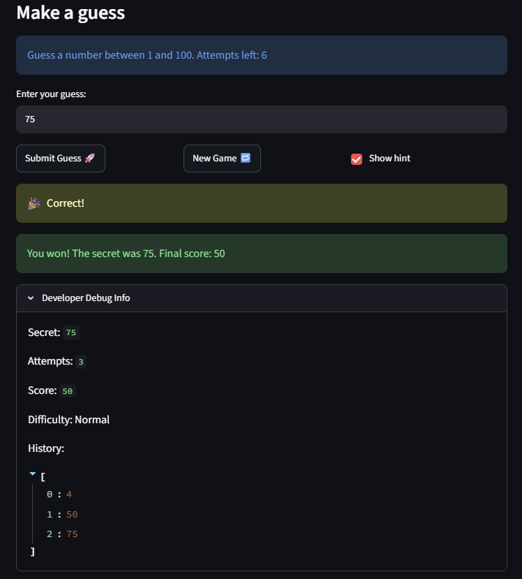
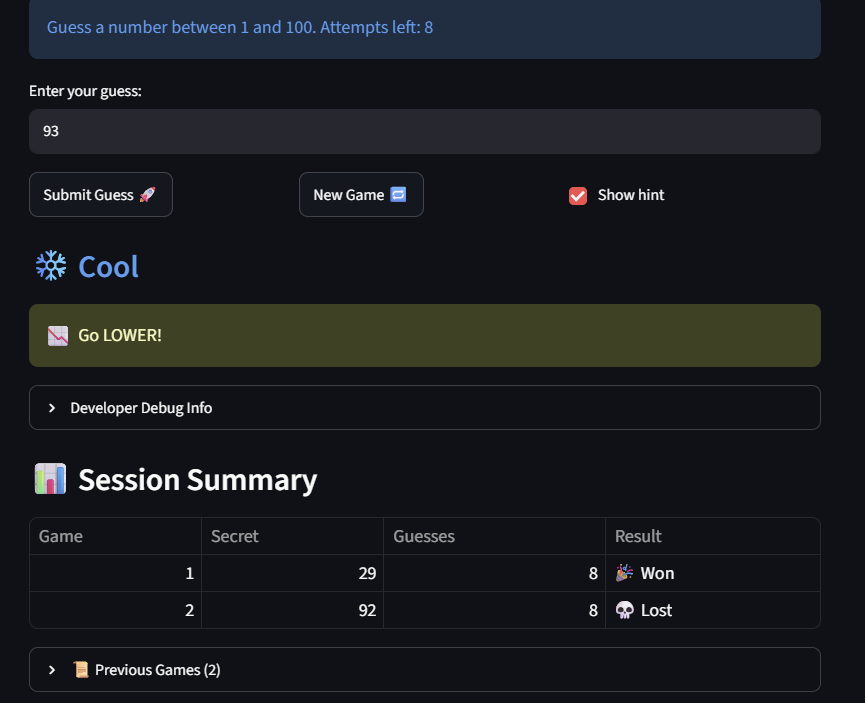

# 🎮 Game Glitch Investigator: The Impossible Guesser

## 🚨 The Situation

You asked an AI to build a simple "Number Guessing Game" using Streamlit.
It wrote the code, ran away, and now the game is unplayable. 

- You can't win.
- The hints lie to you.
- The secret number seems to have commitment issues.

## 🛠️ Setup

1. Install dependencies: `pip install -r requirements.txt`
2. Run the broken app: `python -m streamlit run app.py`

## 🕵️‍♂️ Your Mission

1. **Play the game.** Open the "Developer Debug Info" tab in the app to see the secret number. Try to win.
2. **Find the State Bug.** Why does the secret number change every time you click "Submit"? Ask ChatGPT: *"How do I keep a variable from resetting in Streamlit when I click a button?"*
3. **Fix the Logic.** The hints ("Higher/Lower") are wrong. Fix them.
4. **Refactor & Test.** - Move the logic into `logic_utils.py`.
   - Run `pytest` in your terminal.
   - Keep fixing until all tests pass!

## 📝 Document Your Experience

- The purpose of this game is to correctly guess the randomly selected secret number. 
- Bugs that were found include:
   1. Misleading Hints
   2. Secret is a str
   3. Out-of-range guesses
   4. "New Game" not working
   5. "New Game" ignored difficulty
   6. Hard-coded prompt range
   7. First game starts at 1 attempt
   8. Wrong score in debug panel
- How these bugs were fixed:
   1. swapped the messages in check_guess so that too-high guesses output "Go LOWER" and too-low guesses output "Go HIGHER"
   2. compare the guess against the integer secret
   3. added a check for guesses using "is_in_range()"
   4. "New Game" will reset attempts and other relevant game data
   5. Make the new secret use the active difficulty's range
   6. The prompt now shows the actual range for the chosen difficulty
   7. Initialized attempts to 0 
   8. Move the debug panel to the end of the script so it reflects the up-tp-date score

## 📸 Demo Walkthrough

Describe your fixed game in numbered steps so a reader can follow along without watching a video:

1. User enters 70
2. Hint says "Too High"
3. User enters 25 -> "Too Low"
4. Score updates correctly after each guess. 
5. Game ends after the correct guess.

**Screenshot** *(optional)*: 

## 🧪 Test Results

```
collected 11 items                                                                                                 

tests/test_game_logic.py::test_too_high_guess_says_go_lower PASSED                                           [  9%]
tests/test_game_logic.py::test_too_low_guess_says_go_higher PASSED                                           [ 18%]
tests/test_game_logic.py::test_correct_guess_wins PASSED                                                     [ 27%]
tests/test_game_logic.py::test_single_digit_guess_below_secret_is_too_low PASSED                             [ 36%]
tests/test_game_logic.py::test_double_digit_guess_above_secret_is_too_high PASSED                            [ 45%]
tests/test_game_logic.py::test_guess_inside_range_is_valid PASSED                                            [ 54%]
tests/test_game_logic.py::test_guess_at_boundaries_is_valid PASSED                                           [ 63%]
tests/test_game_logic.py::test_guess_below_range_is_rejected PASSED                                          [ 72%]
tests/test_game_logic.py::test_guess_above_range_is_rejected PASSED                                          [ 81%]
tests/test_game_logic.py::test_difficulty_ranges PASSED                                                      [ 90%]
tests/test_game_logic.py::test_unknown_difficulty_defaults_to_normal_range PASSED                            [100%]

=============================================== 11 passed in 0.05s ================================================
```

## Challenge 1 Test Results

=================================================================== test session starts ====================================================================
platform win32 -- Python 3.13.5, pytest-9.0.3, pluggy-1.6.0
rootdir: C:\Users\adami\OneDrive\Desktop\AI-110\ai110-module1show-gameglitchinvestigator-starter
plugins: anyio-4.13.0
collected 26 items                                                                                                                                          

tests\test_game_logic.py ..........................                                                                                                   [100%]

==================================================================== 26 passed in 0.06s ====================================================================

## 🚀 Stretch Features

- [ ] [If you choose to complete Challenge 4, describe the Enhanced UI changes here — a screenshot is optional]

Changes: 
1. Color-coded Hot and Cold hints! 
   - depending on how close you are to the secret, you will either see Hot, Warm, Cool, or Cold
2. Session Summary Table!
   - Allows you to see previous games with gusses and whether or not you correctly guessed the secret number


